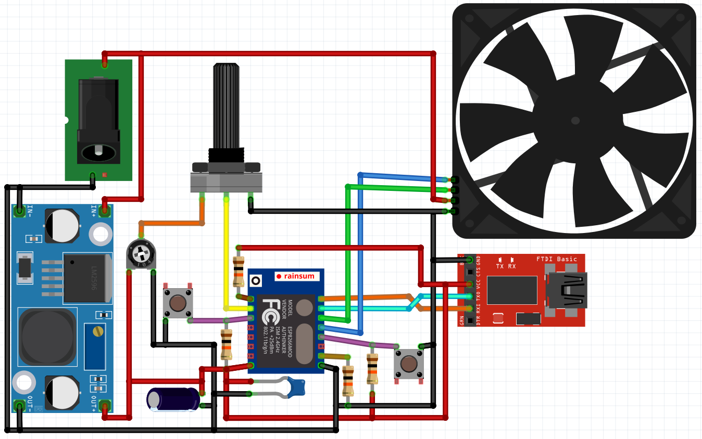

# WiFi-Poti-Fan
Fan controller with a WiFi controlled ESP8266.

This circuit controls 4 pin fans which accept a 25kHz PWM signal for speed control. It was tested with 5V and 12V fans - please select the step down converter accordingly. The ESP12F always runs with 3,3V so even the 5V version needs a voltage regulator.

| #  |         **Components**         |
|----|--------------------------------|
| 1x | ESP12F                         |
| 4x | 10kΩ resistor                  |
| 1x | 10μF elko                      |
| 1x | 100nF ceramic capacitor        |
| 2x | push button                    |
| 1x | trim potentiometer             |
| 1x | linear potentiometer           |
| 1x | 6 pin pcb connector            |
| 1x | 5mm drum socket                |
| 1x | 12V or 5V step down converter  |
| ?  | as many 4 pin fans as you like |

Additionally you need an FTDI adapter for programming.

You also need a power supply which depends on the fans you are using. One 5V fan can easily be supplied with a USB cable connected to a notebook. 25 12V fans work well with a power supply with 2 A.

## Circuit

There is a schematic exported from fritzing [here](wiring/Schaltplan.pdf). You may modify the [fritzing file](wiring/Schaltplan_Luefter.fzz) if you like.

If you want to connect more than one fan just supply the pwm signal to all of them. This works fine if you trust in the capability of the fans to control themselves. Leave the connection for the tache signal connected to the first fan. You may use free pins on the ESP to connect additional tachs signals but the pin count of the ESP is very limited. With 25 fans you just have to believe in their capability to control themselves and skip the feedback.

## Programming

This software is designed to be flashed with [PlatformIO](https://platformio.org/install/ide?install=vscode). All the dependencies are noted in [platformio.ini](platformio.ini).
